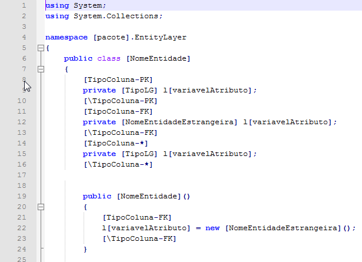

> Ferramenta Case RADPIM

> Na ferramenta CASE proposta são utilizados os conceitos da MDA
> elaboracionista, ou seja, a geração de código fonte para a plataforma
> escolhida é feita a partir de um modelo independente de plataforma,
> que não contém informações estruturais. O meta modelo utilizará UML
> *Profile *por meio de uma variação do diagrama de classes da UML, com
> algumas limitações e adição de características que auxiliarão no
> processo de geração de artefatos. A representação do modelo
> independente é gerada em formato XML, permitindo assim sua exploração
> por ferramentas terceiras, pois como o formato é aberto e utiliza uma
> representação padrão, integrações poderão ser feitas sem demasiados
> esforços.

> São exemplos de artefatos possíveis de geração a partir do meta
> modelo:

-   Código fonte para os CRUDs;
-   *Script* de criação de banco de dados;
-   Modelos de dados;
-   Modelo de classes UML.

1.  1.  ## Modelagem 

        1.  ### Informações necessárias ao modelo

> O meta modelo proposto é um modelo derivado do modelo de entidades
> acrescido de informações semânticas inteligíveis pelo usuário,
> necessário para a construção de uma interface amigável na construção
> dos CRUDS. Em comparação com os diagramas da UML seria similar ao
> diagrama de classes, com algumas restrições e com a adição de algumas
> características como a descrição de atributos de forma amigável para o
> usuário da aplicação.

> Na tela ilustrada na Figura 8 é mostrada a janela principal da
> ferramenta de diagramação implementada, que auxiliará a construção de
> um modelo PIM. Nela são ressaltadas suas principais funcionalidades e
> um exemplo de diagrama proposto, no qual temos as entidades Pessoa,
> Cliente, Funcionário e Empresa. Sua principal característica é que os
> tipos de dados não estão atrelados a qualquer plataforma de
> desenvolvimento, isto devido à exigência da MDA para a elaboração de
> um modelo independente de plataforma (PIM).

Figura 8 – Diagramador de Entidades

> Conforme podemos ver na figura acima, é possível adicionar uma nova
> entidade por meio do item de botão 1, ao acionar esta opção a nova
> entidade é exibida no diagrama, permitindo realizar as demais
> operações sobre ela.

> Pelo botão número 2 podemos criar um relacionamento de herança entre
> duas entidades, para tanto basta clicar na primeira entidade acionar
> este botão e clicar na entidade cujas propriedades desejamos herdar.
> Uma linha que as liga percorre de uma entidade a outra e a entidade
> que herdou exibe o nome da que foi herdada em sua barra de
> identificação.

> Por meio do item 3, é possível a indicação do atributo da entidade
> como chave, os atributos chaves identificarão as instâncias de cada
> entidade unicamente. Ao realizar este procedimento um símbolo de uma
> chave é apresentado ao lado do atributo.

> O botão 4 permite a adição de novos atributos para a entidade, o nome
> do atributo é composto por um identificador e um tipo de dado
> separados por “:”.

> A representação do projeto como um modelo de entidades de domínio,
> acrescido de informações semânticas para o usuário é uma forma de
> aproveitar a familiaridade do analista com outras ferramentas de
> modelagem UML ou modelagem de dados, no intuito de deixá-la mais ágil.
> Assim, podendo direcionar seu esforço para a correta discriminação das
> entidades e de seu relacionamento. A possibilidade de uso de herança
> entre as entidades nos leva ao que já é feito em diagramas de classes
> UML durante a fase de análise e projeto. No entanto, no diagrama da
> UML os atributos são descritos sem se preocupar com o entendimento do
> usuário final e é vinculado a uma plataforma de desenvolvimento
> específico, pois atrela tipos de dados referentes à linguagem
> específica o que não ocorrerá no diagrama proposto.

> De fato, conforme proposto pela OMG na MDA a transformação de modelos
> é uma prática recomendada, pois diminui o esforço para manter
> atualizados os vários modelos.

1.  1.  1.  ### Formato do meta modelo

> O modelo é representado em XML e será associado a uma extensão de
> arquivo “.pim” (*plataform independent model*), que será associado a
> ferramenta elaborada por esse trabalho. Na estrutura XML são
> utilizados elementos de um *schema* definido para o armazenamento das
> entidades e seus relacionamentos nos arquivos de diagramas. O *schema*
> é representado por um arquivo “.xsd” e é um padrão definido pela W3C
> \[XSD, 2009\].

> O formato escolhido atende a mais uma exigência da MDA por ser XML seu
> conteúdo pode ser interpretado facilmente por outras ferramentas MDA
> permitindo a integração com aplicações terceiras.

1.  1.  1.  ### Recursos associados ao meta modelo

> O meta modelo é utilizado em três situações: no processo de modelagem
> auxiliado pela ferramenta de diagramação, no processo de geração de
> código onde será consumido e nos casos de transformação de modelos.
> Sendo esta última deixada como ponto de extensão em trabalhos futuros.

> Segundo Frankel, estes processos são alguns dos definidos como pontos
> de potencial auxílio por ferramentas CASE no paradigma de
> desenvolvimento MDA \[FRANKEL, 2003\].

1.  1.  ## Geração de código

        1.  ### Definição e uso de um estilo arquitetural

> Para a geração de um *template* que corresponda a um CRUD como um
> todo, será necessário criá-lo com conhecimentos da linguagem alvo,
> SGBD alvo ou *framework* de persistência, arquitetura alvo e da
> linguagem de marcação utilizada no modelo para referenciar as
> entidades no momento da geração.

> O primeiro passo para a geração de um *template* e ter o código fonte
> de um caso de uso simples, na arquitetura alvo sem erros de
> compilação. A partir disto, passamos a identificar nos seus arquivos
> as informações de entidades, atributos e projeto. Realizando uma
> engenharia reversa para transformá-lo em um template por adicionar as
> devidas *tags* tanto no seu conteúdo quanto nos nomes dos arquivos e
> pastas que compõem o código fonte do projeto.

1.  1.  1.  ### Linguagem de marcação

> A linguagem possibilita a derivação de código a partir dos objetos no
> modelo. Suas *tags* são identificadas com nomes entre colchetes e
> poderão ser aplicadas em nomes de arquivos ou no conteúdo dos arquivos
> que compõem um *template*. As *tags* representam uma informação ou
> estrutura de controle, de forma que uma *tag* com uma barra antes do
> seu identificador fecha o bloco respectivo. Esta linguagem de marcação
> possui formas de acesso a atributos e estruturas para iteração.

> Na MDA é citada a criação de modelos de código, aqui chamados de
> *templates*, para auxiliar na atividade de geração de código fonte,
> porém não é definido um padrão de como fazê-lo, neste trabalho foi
> adotado uma linguagem de marcação para compor os *templates* e assim
> possibilitar a geração de código fonte.

> Abaixo seguem as *tags* separadas por grupo de aplicação.

-   *Tag* de projeto:

    -   \[pacote\] - identifica o projeto atual, pode ser utilizada nos
        nomes de arquivos e em seu conteúdo.

-   *Tags* de controle:

    -   \[nivelpacote\] - identificador utilizado no nome de arquivo
        para sinalizar que não é necessário realizar uma iteração para
        entidade em seu conteúdo.
    -   \[fixo\] – identifica os arquivos ou pastas que devem ser apenas
        copiados sem sofrer alterações, os arquivos binários são um caso
        de aplicação.
    -   \[pasta\] – identifica o caminho físico do arquivo que está
        sendo processado.
    -   \[ParaCadaEntidade\]...\[\\ParaCadaEntidade\] o conteúdo no
        interior deste bloco será repetido para cada entidade no
        projeto.
    -   \[TipoColuna-\<TipoDeDado>\]..\[\\TipoColuna-\<TipoDeDado>\] o
        conteúdo do bloco será repetido para cada atributo que
        satisfizer o parâmetro \<TipoDeDado> que pode ser: PK, FK, \* ,
        Numero, Texto ou qualquer tipo de dado mapeado.

-   *Tags* de Entidade:

    -   \[NomeEntidade\], \[DescricaoMaiuscula\], \[variavelEntidade\],
        \[DescricaoMinuscula\], \[QuantidadeAtributos\], \[pacote\] para
        cada entidade percorrida o template receberá os valores para
        estes atributos.

-   *Tags* de Atributos:

    -   \[NomeAtributo\], \[variavelAtributo\], \[Coluna\], \[TipoLG\],
        \[TipoDB\], \[Legenda\], \[NomeEntidadeEstrangeira\],
        \[AtributoExibicaoExtrangeira\], \[AtributoValorExtrangeira\],
        \[NumeroColuna\] representam as informações disponíveis de um
        atributo em questão.

1.  1.  1.  ### Geração de *templates*

> A geração de *templates* unifica um estilo arquitetural mapeado na
> instituição e embuti nele as *tags,* descritas na sessão anterior,
> para a definição de arquivos genéricos para qualquer entidade. Um
> *template* é um conjunto de arquivos que podem estar estruturados em
> pastas com atribuições de *tags.* Por exemplo, caso um arquivo seja
> único no projeto do estilo arquitetural e não deva sofrer alteração em
> nenhum projeto, seu nome deve ter a *tag* \[nivelpacote\]. Abaixo
> seque uma listagem de arquivos que compõem um *template* para um
> estilo arquitetural.

Figura 9 – Exemplos de arquivos compondo um *template*

> Os arquivos que compõem o *template *contêm *tags *para definir as
> partes que devem ser repetidas para cada atributo de cada entidade. Na
> Figura 10 é mostrado um arquivo na linguagem C# utilizando *tags* para
> definir como se dará as iterações de suas propriedades no arquivo.
> Vale ressaltar que como o nome do arquivo contém a *tag*
> \[NomeEntidade\] será gerado um arquivo deste para cada entidade no
> momento da geração de código.

Figura 10 – Trecho do arquivo \[NomeEntidade\].cs

> No *template* o único arquivo obrigatório é o TipoDados.xml, ele faz o
> vínculo entre os tipos de dados do modelo PIM os da linguagem de
> programação alvo utilizada nos demais arquivo no *template* e os do
> sistema gerenciador de banco de dados (SGBD), também utilizado no
> *template*. Na Figura 11 é listado um exemplo, tal arquivo poderá ser
> utilizado por outros *templates* que tiverem semelhanças quanto aos
> aspectos da linguagem alvo de geração e SGBD.

Figura 11 – Exemplo do arquivo TipoDados.xml

1.  1.  1.  ### Processo de geração

> No paradigma MDA a geração de código, ou abordagem traducionista, é
> geralmente realizada a partir de um modelo de plataforma específica
> (PSM), que por sua vez é proveniente de um modelo independente de
> plataforma (PIM), neste trabalho é implementada uma tradução direta do
> modelo PIM para o código fonte, desta forma as informações de
> plataforma específicas ficam concentradas nos templates, adicionando
> assim uma maior valorização do modelo PIM.

> O processo de geração consiste em percorrer todos os arquivos no
> *template* gerando cópias dos mesmos e posteriormente embutindo
> informações onde houver *tags*. As quais são utilizadas para marcar no
> *template* onde e como deve ocorrer o preenchimento das informações
> das entidades presentes no modelo selecionado.

> As *tags* de iteração ocasionam a repetição do trecho interno pelas
> várias entidades ou vários atributos. O processo de geração interpreta
> estas *tags* e as demais e realiza as ações necessárias para a
> inclusão das informações de forma correta. Neste processo também são
> identificados os casos em que um *template* não está sintaticamente
> correto quanto ao uso das *tags*. Por exemplo, abriu uma *tag* e não a
> fechou, nesse caso será informado ao usuário o erro encontrado para
> que este faça as correções necessárias no *template*.

> Em resumo as ações tomadas por este processamento são: verificar o
> nível do arquivo no *template,* esse nível é dado pela presença ou
> ausência da *tag* \[nivelpacote\]. Caso esta exista, a única *tag* que
> o arquivo pode conter é a \[pacote\], que é a *tag* que identificará o
> pacote ou grupamento lógico de classes geradas. Uma vez identificado o
> nível do arquivo, este sofrerá a iteração pelas várias entidades caso
> não tenha a *tag *\[nivelpacote\] em seu nome e tenha *tag* específica
> para a iteração de entidades como a *tag *\[paracadaEntidade\]
> \[\\paracadaEntidade\] ou ainda se no nome do arquivo tiver a *tag
> *\[NomeEntidade\], neste caso será gerado um arquivo separadamente
> para cada entidade

> No processo de procura por *tags,* são utilizadas expressões regulares
> para encontrar as ocorrências *no meio de códigos fontes *e assim
> realizar as substituições necessárias.

> Para acionar o processo de geração de código, a partir da tela do
> diagramador, mostrado na Figura 8, deve-se ir ao *menu* “Ferramentas”
> em seguida acionar a opção “Gerar código fonte...”, uma tela é exibida
> mostrando as entidades que serão geradas, neste momento é possível
> realizar ajustes como o nome da classe que será gerada na linguagem
> alvo, a tabela no banco de dados em que será persistida etc.

Figura 12 – Geração de código: Ajuste de entidades.

> Dentre os ajustes possíveis na tela mostrada na Figura 12 estão as
> operações de exclusão, edição e criação de novas entidades, ajuste nos
> atributos quanto aos tipos de dados, nomes e membro representante na
> classe.

> Após os ajustes necessários deve-se clicar no botão “próximo” para dar
> continuidade ao processo, mais algumas opções deverão ser informadas
> como o *template* a ser utilizado, um nome lógico (somente formado por
> letras) para a aplicação gerada e um local onde será salva.

Figura 13 – Geração de código: opções da geração

> Durante o processamento a barra de progresso identificará o percentual
> da geração realizada até o momento e, ao seu final, uma mensagem é
> exibida informando a conclusão da atividade.

> Estudo de caso

> Para demonstrar a aplicação da ferramenta, um diagrama será elaborado
> e posteriormente realizada a geração do código fonte para os casos de
> uso do tipo CRUD das entidades definidas no exemplo.

> Dada a situação hipotética de uma organização que atue no segmento de
> *outsourcing* (Terceirização de serviços) e deseja manter um cadastro
> de seus clientes e das empresas parceiras e funcionários contratados
> por estas, em que os funcionários devem estar prestando serviço por
> apenas uma empresa parceira.

> Mapeando as entidades e relacionamentos do caso explicitado acima
> chegamos ao diagrama dado pela Figura 14 onde existem as entidades:
> Pessoa, Cliente, Funcionário e Empresa. As entidades Cliente e
> Funcionário herdam as propriedades da entidade Pessoa e em Funcionário
> temos uma propriedade que é do tipo Empresa, desta forma cada
> funcionário deve estar vinculado a uma empresa específica.

> O fato de criarmos a entidade pessoa serve para agilizar o processo de
> diagramação, porque as informações de atributos que seriam repetidos
> nas demais entidades especializadas são informadas apenas uma vez.

Figura 14 – Diagrama de entidades PIM

> Acionando o *menu *“Ferramentas” e “Gerar Código Fonte...” a tela de
> edição das entidades é mostrada possibilitando realizar os ajustes
> antes de prosseguir com a geração. Neste ponto selecionamos a entidade
> Pessoa e a deletamos pois não será necessária, nas demais não
> precisamos realizar ajustes. Portanto seguimos ao passo adiante
> acionando o botão “próximo”, como resultado a tela de configurações da
> geração é exibida, Figura 16.

Figura 15 – Entidades após justes.

> O *template* utilizado será o definido na Figura 9 que se refere a uma
> aplicação web em ASP.Net na linguagem C#, pronto para ser segregado em
> 3 camadas, utilizando o sistema gerenciador de banco de dados MySQL,
> fazendo uso do *framework* AJAX (ASPNETAJAX), alguns padrões de
> projeto e um padrão visual já definido. Todo este aparato é
> contemplado no *template* e poderá ser reutilizado em vários projetos.
> Após a geração do código fonte os mesmos serão compilados e executados
> para permitir a realização de alguns cenários integrantes dos casos de
> usos CRUD.

Figura 16 – Geração concluída

> Após a finalização da geração podemos conferir os arquivos gerados na
> pasta especificada como saída. Entre estes arquivos está o
> “MonoExe.Web.UI.sln” que possibilita abrir a solução completamente,
> habilitando as opção de compilação e execução na IDE (*Integrated
> Development Environment*) do Visual Studio, vale lembrar que esta IDE
> é utilizada apenas por conveniência uma vez que seja possível a
> compilação bastando apenas ter o framework SDK.net instado na estação.
> Trata-se de um software livre e multi-plataforma mantida pelo projeto
> Mono na plataforma Linux e pela Microsoft na plataforma Windows. A
> Figura 17 mostra os arquivos e pastas gerados na pasta de saída.

Figura 17 – Arquivos gerados

> As classes geradas a partir do modelo citado são apresentadas na
> Figura 8. Tomando a entidade Cliente como exemplo, ela possui as
> propriedades código do cliente e data de cadastro, além disso, herda
> as propriedades nome e CPF da entidade Pessoa. O atributo código do
> cliente é uma chave da entidade, isso implica que identificará
> unicamente cada ocorrência desta entidade.

> Derivada do arquivo de *template* “\[NomeEntidade\].cs” temos o
> arquivo “Cliente.cs” listado na Figura abaixo, a partir dele e seu
> correspondente no *template* da Figura 11, podemos ter uma idéia dos
> arquivos resultantes nos demais casos.

> Ao solicitar a compilação da solução, vemos que ela é compilada com
> sucesso, ou seja, não existem erros de compilação no código gerado
> para a aplicação tomada como exemplo. Devido à variedade de
> possibilidades de diagramação, alguns erros de compilação que ainda
> não são tratados pelo gerador de código podem ocorrer, um exemplo é
> quando o *template* gera métodos com sobrecarga com argumentos de
> mesmo tipo, isto é considerado um erro pelo compilador C#. Esse e
> demais casos são considerados como pontos de melhoria e são deixados
> como possíveis trabalhos futuros. De qualquer forma, tendo o
> *template* uma codificação clara, esses erros podem ser facilmente
> fixados.

Figura 18 – Solução e Projetos abertos na IDE Visual Studio

> Iniciando a aplicação por essa IDE um emulador de servidor web é
> iniciado e a aplicação é aberta no navegador para utilização. A tela
> de cadastro da entidade Cliente é apresentada na Figura 19.

> Na parte superior de todas as páginas existe um link para todas as
> entidades geradas, ao acionar o item de *menu* da entidade cliente sua
> tela de consulta é carregada, para mostrar todos os registros sem
> aplicar filtros basta clicar no botão consultar, A tela com o
> resultado desta operação é mostrado na Figura 19.

> Para adicionar novos clientes a opção “Incluir” deve ser acionada,
> logo uma tela de cadastro com os campos da entidade Cliente é exibida
> para preenchimento, após o preenchimento e clique no botão “Salvar” é
> solicitada a confirmação, o resultado desta operação está presentes na
> tela ilustrada na Figura 20.

Figura 19 – Tela de consulta para a entidade Cliente

Figura 20 – Tela de inclusão da entidade Cliente

> A operação de edição pode ser acionada a partir da listagem dos itens
> existentes conforme exibido na Figura 19, ao clicar no link “Editar”
> presente ao lado de cada registro. Assim a tela de cadastro é
> carregada com os dados atuais do registro, preenchendo os campos e os
> disponibilizando para edição.

> Na tela de edição ainda é possível acionar a opção de excluir o
> registro que está sendo editado. Ao escolher essa opção uma
> confirmação é solicitada e confirmando tal operação o registro é
> excluído do banco de dados.

> Como vimos, a geração de código fonte para os casos de uso do tipo
> CRUD pode ser facilmente realizada pelo uso da ferramenta implementada
> neste trabalho. No entanto, vários pontos podem ser melhorados em
> trabalhos futuros, porém uma boa parte da aplicação pode ser gerada de
> forma automática, reusando o estilo arquitetural contemplado no
> *template*, gerando assim aplicações em conformidade com as
> necessidades e padrões de uma organização.

1.  # Considerações Finais

> A ferramenta CASE apresentada é uma opção para facilitar a
> implementação do reuso arquitetural na organização, e assim beneficiar
> o processo de desenvolvimento nas fases de análise e projeto,
> implementação e nas demais onde houver atividades capazes de serem
> auxiliadas. O foco é dado na geração de código fonte para casos de uso
> do tipo CRUD. Porém, a geração de outros artefatos também pode ser
> realizada como é demonstrado o caso do modelo de dados. Potencializa a
> utilização de modelos desvinculados a plataformas e tecnologias e o
> faz presente e útil em mais atividades no processo de desenvolvimento
> de sistemas.

> Facilita a disseminação de padrões e boas práticas, uma vez que estes
> podem estar contemplados nos *templates *e assim passam a ser
> utilizados por toda a organização.

> Vale ressaltar que o *template* utilizado é exemplificativo e outros
> podem ser gerados para diferentes plataformas de desenvolvimento e
> arquitetura de aplicação. Pois, sua principal característica é a
> flexibilidade de adequar-se aos diversos estilos arquiteturais e a
> possibilidade de extensão para prover às organizações de apoio no
> processo de desenvolvimento, desde a independência de plataforma na
> modelagem até a geração de artefatos de forma automática.

1.  1.  ## Possibilidades de extensão e melhoria da ferramenta.

> Pela informação semântica adicionada ao meta modelo seria possível
> também identificar uma possível matriz de rastreabilidade entre os
> casos de uso na aplicação. Nesse momento, isto é apenas uma
> possibilidade e é deixada como um dos trabalhos futuros.

> Na ferramenta proposta, visivelmente, são possíveis duas
> transformações de modelos. A primeira é a geração de um modelo de
> dados a partir do modelo PIM, evidenciado pelo script de geração do
> banco de dados, para realizar esta transformação seria interessante um
> formato de modelo de dados que fosse aberto e com uma representação de
> fácil leitura como um XML. Uma ferramenta de modelagem que apresenta
> um modelo adequado a estas características é o DBDsigner, um software
> livre multi-plataforma distribuído sob a licença GNU GPL e mantido
> pela fabForced \[DBD, 2009\].

> O Diagrama UML de classes é outra possibilidade também deixada como
> trabalho futuro e não será demonstrada na ferramenta. Porém, é fácil
> verificar que tal transformação é possível pelas informações presentes
> no PIM e nos *templates* de artefatos.

> Outro ponto de melhoria seria poder dividir os *templates* em grupos
> independentes por funcionalidades e requisitos assim evitando gerar
> código desnecessário para a aplicação. Por exemplo, em um determinado
> caso de uso poderia ser marcado para gerar código apenas do formulário
> de inserção e de consulta, excluindo os de deleção e atualização. Ou
> ainda, para determinada entidade o acesso ser disponível também por
> *web service*. Na verdade todas essas possibilidades são viáveis para
> possíveis próximos trabalhos.

\[CORAL, 2006\] Coral Calero, Francisco Ruiz, and Mario Piattini,
editors. Ontologies for Software Engineering and Software Technology.
Springer-Verlag Berlin Heidelberg, 2006

\[SVOBODA, 1993\] Svoboda, C. (1993); “Flexible Automation with
Meta-CASE”; Results from the5th International Workshop on Computer-Aided
Software Engineering (CASE ‘92), Montréal, Québec, Canada, 26; OCRI
Publications.

\[COC, 2009 \] Convention_over_Configuration, msdn magazine. Disponível
em: \<http://msdn.microsoft.com/en-us/magazine/dd419655.aspx#id0080100>.
Acesso em: 02 jul. 2009.

\[YODER, 1998\] J. Yoder, R. Johnson, Q. Wilson. “Connecting Business
Objects to Relational Databases”. Proceedings of Plop98. Technical
Report #wucs-98-25, Dept. of Computer Science, Washington University
Department of Computer Science, 1998.

\[GAMMA, 1995\] Erich Gamma, Richard Helm, Ralph Johnson, John Vlissides
Design Patterns: Elements of Reusable Object-Oriented Software
\[Livro\]. - \[s.l.\] : Addison-Wesley, 1995.

\[BUXTON, 70\] Buxton, J. N. e Randell, B. “Software Engineering
Techniques.” Proceedings of the NATO Software Engineering Conference.
Rome, Italy, April 1970.

\[FOWLER, 2000\] Fowler, M.; Scott K. UML essencial: um breve guia para
a linguagem-padrão de modelagem de objetos. 2. ed. Porto Alegre:
Bookman, 2000.

\[UML, 2001\] UML 1.4 Specification. Chapter 2 -UML Semantics, Setembro,
2001, Disponível em:
\<http://www.omg.org/technology/documents/formal/uml.htm>. Acesso em: 04
jan. 2008.

\[JACOBSON, 1992\] I. Jacobson, M. Christerson, P., and G. Övergaard.
Object Oriented Software Engineering: A Use-Case Driven Approach.
Addison-Wesley, 1992.

\[JACOBSON, 2000\] JACOBSON, I.; BOOCH, G.; RUMBAUGH, J. UML: Guia do
usuário. Tradução Fábio Freitas da Silva. Rio de Janeiro: Campus, 2000.

\[REYLLE, 2003\] Learning UML. Reylle, O; 07/2003

\[FRANKEL, 2003\] Frankel, David S., Model_Driven_Architecture.
Applying\_ MDA to Enterprise Computing, Wiley Publishing, 2003.

\[OMG, 2009\] The Architecture of Choice for a Changing World, OMG.
Disponível em: \<http://www.omg.org/mda/specs.htm>. Acesso em: 17 jul.
2009.

\[RUBYONRAILS, 2009\] Ruby on Rails, Ruby on Rails. Disponível em:
\<http://www.rubyonrails.org>. Acesso em: 17 jul. 2009.

\[VAZEXQI, 2008\] VAZEXQI, Convention over Configuration; 10/08/2008.
Disponível em:
\<http://softwareengineering.vazexqi.com/files/pattern.html>. Acesso em:
02 jul. 2009.

\[HAYWOOD, 2004\] "MDA: Nice Idea, Shame About the...", THERSERVERSIDE.
– 10/08/2004. Disponível em:
\<http://www.theserverside.com/articles/article.tss?l=MDA_Haywood>.
Acesso em: 02 jul. 2009.

\[HERON, 2008\] xUML - Executable UML; 13/08/2008. Disponível em:
\<http://www.heron-language.com/xuml.html>. Acesso em: 02 jul. 2009.

\[MELLOR e BALCER, 2002\] MELLOR, S.J., BALCER, M.J., 2002, Executable
Uml: A Foundation for Model- Driven Architecture, Addison-Wesley
Professional.

\[FOWLER E SCOTT, 2003\] M. Fowler and K. Scott. UML Distilled: A Brief
Guide to the Standard Object Modeling Language (Third Edition). Addison
Wesley, Readings MA, USA, 2003.

\[SILVA 1998\] SILVA Manoel ROCHA Thayssa. PROJETO DE UMA FERRAMENTA
CASE UTILIZANDO A NOTAÇÃO DA UML E A METODOLOGIA DE COAD e
YOURDON,1998,CESUPA Belém do Pará.

\[KLEPPE ET AL, 2003\] Anneke Kleppe, Jos Warmer, and Wim Bast, MDA
Explained, Addison-Wesley, 2003.

\[XP, 2009\] Extreme Programming, A gentle introduction. Disponível em:
\<http://www.extremeprogramming.org>. Acesso em: 17 set. 2009.

\[XSD, 2009\] XML Schema, W3C XML Schema. Disponível em:
\<http://www.w3.org/XML/Schema> . Acesso em: 10 Ago. 2009.

\[DBD, 2009\] DBDesigner 4, DBDesigner 4 Features. Disponível em:
\<http://fabforce.net/dbdesigner4/features.php>. Acesso em: 17 set.
2009.

\[AndroMDA, 2009\] Andromda, Home. Disponível em:
\<http://www.amdromda.org>. Acesso em: 30 nov. 2009.

\[OptimalJ, 2009\] Objects by Design, OptimalJ Review. Disponível em:
\<http://www.objectsbydesign.com/tools/oj/optimalj.html>. Acesso em: 30
nov. 2009.

\[OptimalJ2, 2009\] Compuware OptimalJ standardizes on Object Management
Group’s Model Driven Architecture. Disponível em:
\<http://www.omg.org/mda/mda_files/MDA_OptimalJ.pdf>. Acesso em: 30 nov.
2009.
